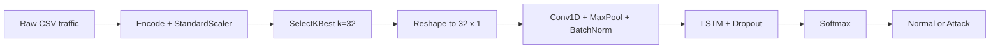
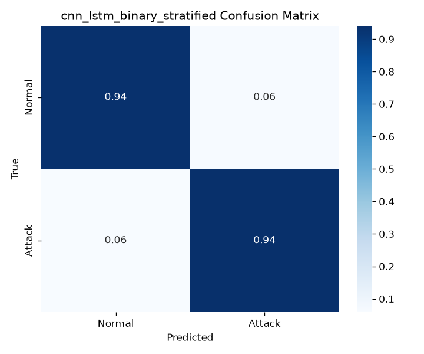
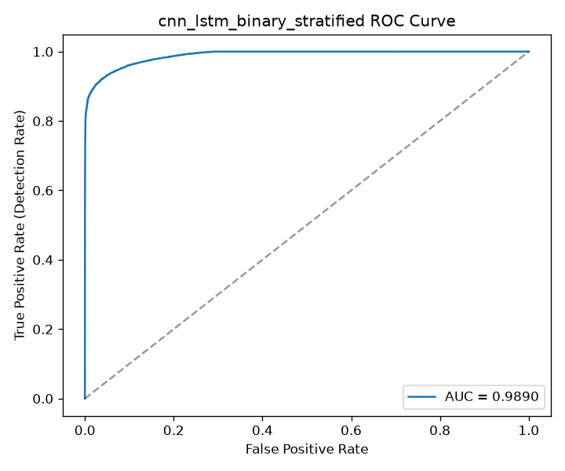
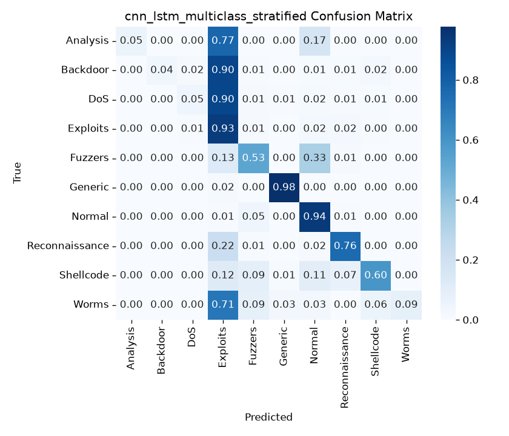

# Intrusion Detection System with Hybrid CNN–LSTM

### Detect network attacks with deep learning — built on UNSW-NB15, aligned with IEEE Access 2022

[](https://www.python.org/)
[](https://www.tensorflow.org/)
[](https://research.unsw.edu.au/projects/unsw-nb15-dataset)
[](https://doi.org/10.1109/ACCESS.2022.3206425)

> **In one sentence:** this project reads network-connection records and predicts whether each one is **normal traffic** or an **attack** — using a hybrid neural network that combines **CNN** (patterns) and **LSTM** (sequence memory).

---

## What was built?

| Piece | What it does (plain English) |
|-------|------------------------------|
| **Preprocessing pipeline** | Cleans raw CSV traffic, converts text to numbers, scales features, picks the best 32 features |
| **CNN model** | Finds local “suspicious combinations” among features |
| **LSTM model** | Remembers relationships across the feature sequence |
| **Hybrid CNN–LSTM** | CNN extracts patterns → LSTM reads them in order → Softmax decides Normal / Attack (or attack type) |
| **Trainer** | Trains with EarlyStopping + safe validation (no misleading scores) |
| **Evaluator** | Reports accuracy, precision, detection rate, F1, **FAR**, confusion matrix, ROC |

**Two modes**
- **Binary** — Normal vs Attack  
- **Multiclass** — 10 categories (Normal, DoS, Exploits, Generic, Fuzzers, …)

---

## Why this matters

Traditional IDS often relies on **known attack signatures**. New (zero-day) attacks slip through.  
Deep learning learns patterns from data, so it can generalize better.

This implementation follows the method of **Halbouni et al.** (*CNN-LSTM: Hybrid Deep Neural Network for Network Intrusion Detection System*, [IEEE Access 2022](https://doi.org/10.1109/ACCESS.2022.3206425)).

---

## How it works



**Hybrid architecture (3 stacked blocks)**

```
Input (32 features, 1 channel)
│
├─ Conv1D(64)  → MaxPool → BatchNorm → LSTM(64) → Dropout(0.2)
├─ Conv1D(128) → MaxPool → BatchNorm → LSTM(64) → Dropout(0.2)
├─ Conv1D(256) → MaxPool → BatchNorm → LSTM(64) → Dropout(0.2)
│
└─ Dense(n_classes, Softmax)  → prediction
```

| Layer | Job |
|-------|-----|
| **Conv1D** | Spot local patterns in the feature vector |
| **MaxPooling** | Keep the strongest signals, shrink the sequence |
| **BatchNorm** | Stabilize and speed up training |
| **LSTM** | Learn order / dependencies across features |
| **Dropout (0.2)** | Reduce overfitting |
| **Softmax** | Output class probabilities |

---

## Results (headline)

Evaluated on **UNSW-NB15** with a stratified split (paper-comparable).

### Binary — Normal vs Attack

| Model | Accuracy | Detection Rate | F1 | FAR ↓ |
|-------|----------|----------------|-----|-------|
| CNN only | 93.72% | 94.41% | 95.05% | 7.49% |
| LSTM only | 92.96% | 94.04% | 94.47% | 8.94% |
| **Hybrid CNN–LSTM** | **93.93%** | **94.13%** | **95.20%** | **6.42%** |

**ROC-AUC (hybrid):** **0.989**

| Reference | Accuracy | Detection Rate |
|-----------|----------|----------------|
| Halbouni et al. (2022) on UNSW-NB15 | ~93.68% | ~94.84% |
| **This project** | **93.93%** | **94.13%** |

### Multiclass — 10 attack types

| Model | Accuracy | F1 | FAR ↓ |
|-------|----------|-----|-------|
| CNN only | 81.34% | 78.30% | 2.40% |
| LSTM only | 80.07% | 78.65% | 2.47% |
| **Hybrid CNN–LSTM** | **82.22%** | **80.31%** | **2.23%** |

**Takeaway:** the hybrid beats both single-model baselines, with high detection and a lower false-alarm rate.

### Visuals

| Binary confusion | Binary ROC | Multiclass confusion |
|------------------|------------|----------------------|
|  |  |  |

More charts: [`report/`](report/) · Comparison bars: [`report/comparison_binary_stratified.png`](report/comparison_binary_stratified.png)

---

## Project map

```
Intrusion-Detection-System-LSTM-and-CNN/
├── data/                  # Put UNSW-NB15 CSVs here (not in git — large)
├── notebooks/
│   └── 01_explore.ipynb   # Exploratory data analysis
├── src/
│   ├── preprocess.py      # Clean → scale → select features
│   ├── model.py           # CNN, LSTM, hybrid CNN-LSTM
│   ├── train.py           # Train + save model + metadata
│   ├── evaluate.py        # Metrics + plots (incl. FAR)
│   └── run_all.py         # Optional full experiment matrix
├── models/                # Trained weights (ignored) + meta JSON
├── report/                # Figures, CSVs, academic write-up, keywords PDF
├── requirements.txt
└── README.md              # You are here
```

---

## Quick start

> **Before you train:** the UNSW-NB15 CSV files are **not** in this GitHub repo (they are large).
> Download them into `data/` first, then run:
>
> ```powershell
> python src/check_setup.py
> ```
>
> Every check must say `[PASS]`. Full demo steps: [`DEMO.md`](DEMO.md) · Dataset help: [`data/README.md`](data/README.md)

### 1. Requirements
- **Python 3.9–3.12** (prefer **3.12**; TensorFlow does not support 3.14 yet)
- Windows / macOS / Linux

### 2. Install

```powershell
git clone https://github.com/sahil143-dotcom/Intrusion-Detection-System-LSTM-and-CNN.git
cd Intrusion-Detection-System-LSTM-and-CNN

python -m venv venv
.\venv\Scripts\Activate.ps1          # mac/linux: source venv/bin/activate
pip install -r requirements.txt
```

### 3. Add the dataset (required)

Download **both** files and place them in `data/` with these **exact** names:

| Filename | Role here |
|----------|-----------|
| `UNSW_NB15_testing-set.csv` | Training (~175k rows) |
| `UNSW_NB15_training-set.csv` | Testing (~82k rows) |

Sources:
- [UNSW research page](https://research.unsw.edu.au/projects/unsw-nb15-dataset)
- Or Kaggle: `mrwellsdavid/unsw-nb15`

Then verify:

```powershell
dir data\*.csv
python src/check_setup.py
```

> **Note:** some copies swap the filenames. This code maps them by **size/role** (larger ≈ train). See [`data/README.md`](data/README.md).

### 4. Train & evaluate (best setup)

```powershell
# Binary (matches the paper best) — use this for demos
python src/train.py --model cnn_lstm --mode binary --split stratified
python src/evaluate.py --model cnn_lstm --mode binary --split stratified

# Multiclass (10 attack types) — only after binary works
python src/train.py --model cnn_lstm --mode multiclass --split stratified
python src/evaluate.py --model cnn_lstm --mode multiclass --split stratified
```

Other models: `--model cnn` or `--model lstm`  
Harder protocol: `--split official` (train/test distribution shift)

**Demo checklist:** [`DEMO.md`](DEMO.md)

---

## Metrics explained (for presentations)

| Metric | Meaning |
|--------|---------|
| **Accuracy** | Overall % correct |
| **Precision** | Of predicted attacks, how many were real |
| **Detection rate (Recall)** | Of real attacks, how many we caught |
| **F1-score** | Balance of precision and recall |
| **FAR** | Normal traffic wrongly flagged as attack (lower is better) |
| **ROC-AUC** | How well the model ranks attack vs normal |

---

## Deliverables (internship-ready)

| File | Purpose |
|------|---------|
| [`report/academic_report.md`](report/academic_report.md) | Full method + results + paper comparison |
| [`report/IDS_Journey_Keywords.pdf`](report/IDS_Journey_Keywords.pdf) | Keywords / buzzwords for viva |
| [`report/report.md`](report/report.md) | Short results index |
| `report/*_stratified_*.png` | Confusion matrices, ROC, training curves |

---

## Tech stack

Python 3.12 · TensorFlow / Keras · pandas · NumPy · scikit-learn · Matplotlib · Seaborn · Jupyter

---

## References

1. Halbouni, A., Gunawan, T. S., Habaebi, M. H., Halbouni, M., Kartiwi, M., & Ahmad, R. (2022). *CNN-LSTM: Hybrid Deep Neural Network for Network Intrusion Detection System*. IEEE Access, 10, 99837–99849. https://doi.org/10.1109/ACCESS.2022.3206425  

2. Moustafa, N., & Slay, J. (2015). *UNSW-NB15: a comprehensive data set for network intrusion detection systems*. MilCIS, IEEE.

---

## License & academic use

UNSW-NB15 is free for academic research (cite Moustafa & Slay).  
This repository is an educational internship implementation of a CNN–LSTM IDS.

---

**Repo:** [sahil143-dotcom/Intrusion-Detection-System-LSTM-and-CNN](https://github.com/sahil143-dotcom/Intrusion-Detection-System-LSTM-and-CNN)
